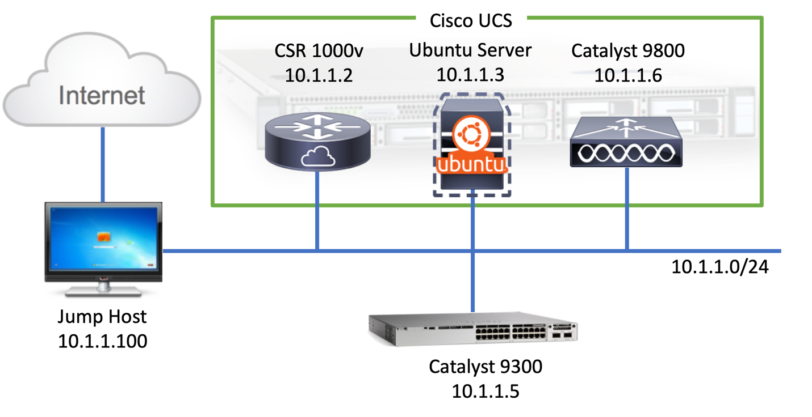
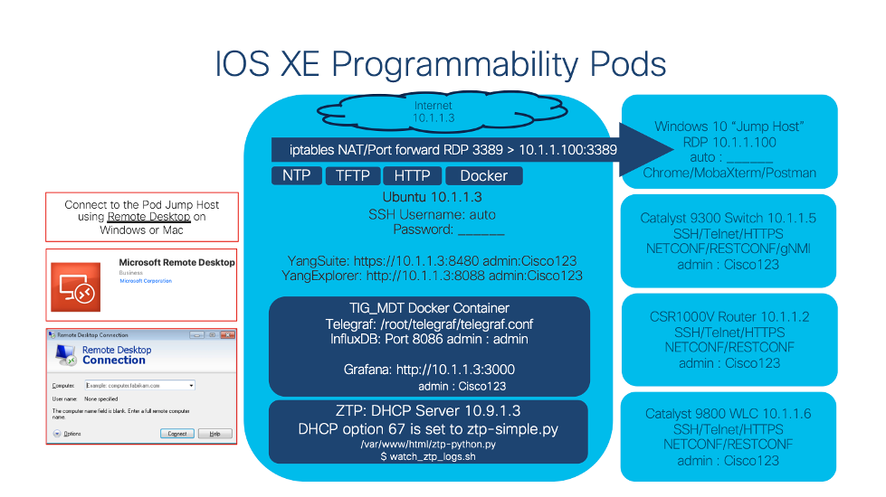

# **IOS XE Programmability and Automation for Network Engineers** - HOLPRG-2003

**Speakers: Krishna Kotha, Jeremy Cohoe**

## Learning Objectives

Welcome to the Cisco Live IOS XE Programmability and Automation for Network Engineers Lab!

Cisco has added a number of new programmability features to Cisco IOS XE to make device management simpler and more efficient. This lab will walk you through several scenarios for configuring IOS XE devices using programmable interfaces and DevOps tools.

Upon completion of this lab, you will be able to: 

- Understand YANG data models
- Find a YANG model for your needs using YANGSUITE
- Use NETCONF and gNMI to communicate with IOS XE devices
- Use Model-Driven Telemetry to collect the data
- Use Guest shell, on-box Python  and integrate EEM on Catalyst 9300 switch
- Write an Ansible playbook to automate your network

# Accessing the lab

To access the lab, you will need to use a Remote Desktop connection to a pod specific jump host. The jump host is used to allow remotes access to all lab devices within a given pod. 

**Your instructor will provide pod access instructions.** 

The services, features, and technologies that are enabled with the lab envrionment are shown below:

# Module 1 - Guest Shell and On-Box Python

#### **https://github.com/krishna426426/Module-1-Guestshell**

Guest Shell is the Linux container that is available within IOS XE. It provides a Python API that enables programmatic device configuration using the included on-box CLI modules. Guest Shell includes the Bash Shell with access to the YUM package manager as well as the Python interpretor which makes it a very flexible and powerful automation option for network engineers.

# Module 2 - YANG Suite

**https://github.com/krishna426426/Module-2-YANGSuite**

**YANG Suite** is a tool developed by Cisco to help you visualize YANG data models downloaded from a device, to test sending and receiving data to/from devices using YANG models, as well as a NETCONF RPC Builder Application to experiment with YANG Data Models.

# Module 3 - Model Driven Telemetry (MDT)

**https://github.com/krishna426426/Module-3-MDT**

The Model Driven Telemetry module contains an overview of the various telemetry interfaces available on IOS XE as well as the YANG data models that are available. CLI tooling and examples for **NETCONF, gRPC, and gNMI** is provided which enables base functionality and validation of the model driven telemetry interfaces. Once the basics of the interfaces are understood then the **Telegraf, InfluxDB, and Grafana tooling** is used for visual representation of the telemetry data. This solution is packaged into a Docker container where the configurations, dashboards, and sample data is avilable for viewing.

# Module 4 - Ansible CLI and NETCONF Automation

#### https://github.com/krishna426426/Module-5-Ansible

In this lab module the Ansible automation tooling is used for a variety of tasks. The Ansible CLI module is used to configure VRFs against multiple IOS XE devices at once. The **ios_config** module is also used to configure some devices features including NTP and ACL's. The **NETCONF** module can be used to further programmatically configure device features using **YANG** data models, so an exmple to enable the **gRPC Model Driven Telemetry** feature is provided. Finally an example playbook is provided to **upgrade the IOS XE switch** to a new version.

# Module 5 - Zero Touch Provisioning (ZTP)

**https://github.com/krishna426426/Module-6-ZTP**

In this module, you will verify and confirm the prerequisites for ZTP, the Zero Touch Provisioning feature of IOS XE on the Catalyst 9300 switch. At the end of this module, you will issue the ‘write erase’ command, reload the switch, and watch as the ZTP process completes and the switch is configured programmatically and automatically.

-------------------------------------------------------------------------------------------------------------------------------------------------------

## Optional

The following module is for your reference and If you still have time feel free to work on it.

# Module 6 - gRPC Network Management Interface (gNMI)

**https://github.com/krishna426426/Module-4-gnmi**

This lab module covers the gRPC Network Management Interface (gNMI) that enables device programmability. gNMI supports Model Driven Telemetry which is covered in the MDT module. An overview of the API interface is provided before reviewing the configuration and implmetation details, specifically the TLS certification generation and installation into IOS XE. The gNMI API is used in both secure and insecure server modes which provides the most flexibility in the lab envrionment. The YANGSuite and gnmi_cli tooling is available to easily interact with the API and some examples for retreiving operational and configuration data is provided.